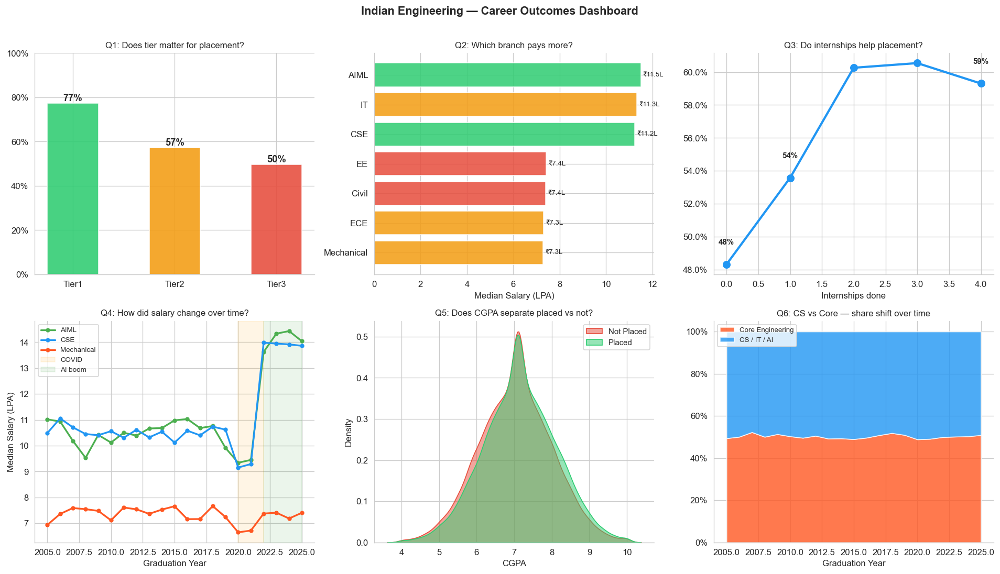

# Engineering Education & Career Outcomes — India (2005–2025)

> Analyzing 56,375 engineering students across 15 states, 11 branches, and 20 years to understand who gets placed, who earns more, and what actually drives career outcomes in Indian engineering.

---

## What problem does this solve?

Every year India produces ~1.5 million engineering graduates. Most placement discussions are anecdotal — "CSE is best", "CGPA matters", "Tier1 only". This project puts numbers behind those claims using real-style data modeled on AISHE reports, AICTE intake figures, and NIRF placement disclosures.

**Three questions this project answers:**
1. Does college tier matter more than branch, or the other way around?
2. What actually predicts placement — CGPA, internships, or something else?
3. How did COVID and the AI boom change salary outcomes?

---

## Key Findings

| # | Finding | Number |
|---|---------|--------|
| 1 | Tier1 placement rate vs Tier3 | **76% vs 53%** — 23pp gap |
| 2 | CSE median salary vs Mechanical | **₹10.5L vs ₹7.4L** — 42% premium |
| 3 | Salary jump post AI boom (2022+) | **Pre-2020: ₹9.2L → Post-2022: ₹12.6L** for CSE |
| 4 | Internship impact on placement | **50% → 69%** from 0 to 3 internships |
| 5 | Core-branch students in software jobs | **~18%** of placed Mech/Civil/EE ended up in software/analytics |

---

## Project Structure

```
engineering_india/
│
├── data/
│   ├── raw_engineering_data.csv        ← 56,375 rows, 39 columns, intentionally dirty
│   └── cleaned_engineering_data.csv    ← generated after running the notebook
│
├── notebooks/
│   └── engineering_analysis.ipynb      ← one notebook, does everything
│
├── app/
│   └── app.py                          ← Streamlit dashboard
│
├── requirements.txt
└── README.md
```

---

## The Raw Data — What Makes It Realistic

Opening `raw_engineering_data.csv` in Excel immediately shows real-world problems:

| Column | Problem | Example |
|--------|---------|---------|
| `branch` | 25+ dirty variants | `CSE`, `cse`, `C.S.E`, `Computer Science`, `CS/IT` |
| `tier` | 9+ dirty variants | `Tier1`, `tier 1`, `T1`, `IIT`, `TIER1` |
| `gender` | 5 spellings each | `Male`, `male`, `M`, `MALE`, `m` |
| `state` | Abbreviations + misspellings | `MH`, `Mah.`, `Maharastra`, `maharashtra` |
| `cgpa` | Scale errors + impossibles | `72.5` (should be 7.25), `0.0`, `11.5` |
| `salary_offered` | 12 different units | `LPA`, `k/month`, `CTC`, `lakhs`, `L`, `per annum` |
| `salary_offered` | Scale entry error | `750` entered instead of `7.5` |
| `internships_count` | Bad form entries | `-1` appears 1,156 times |
| `registration_date` | 5 mixed date formats | `23/07/2020`, `2020-07-23`, `23 Jul 2020` |
| Multiple columns | Random nulls | 5–30% missing depending on field |
| Rows | Duplicate re-submissions | ~1,400 rows with `_DUP` suffix |

---

## What the Notebook Does

One notebook (`engineering_analysis.ipynb`), 23 cells, runs top to bottom without errors.

**Section 1 — Load & Audit**  
Shape check, dtype overview, null counts. First look before touching anything.

**Section 2 — Data Cleaning**  
Nine targeted fixes — each one justified by what the data actually shows, not generic best practices.

- Branch standardization: dictionary map, 25 variants → 11 labels  
- Tier fix: pattern logic (`iit/iiit/t1` → Tier1)  
- Gender fix: lowercase + map  
- State fix: abbreviation lookup + title-case fallback  
- CGPA: detect 40–100 range → divide by 10; zero/impossible → null  
- Salary: unit-aware conversion, scale error correction (>200 → ÷100), cap at 120 LPA  
- Internships: negative values → null  
- Graduation status: 12 dirty variants → 4 clean categories  
- Missing values: group-wise median (branch × tier), not global median  

**Section 3 — Feature Engineering**  
7 new columns, each with a business reason:

| Feature | Why it exists |
|---------|--------------|
| `years_to_graduate` | Delayed graduation is a placement risk signal |
| `delayed` | Binary flag for >4 years |
| `covid_batch` | Grad year 2020–22, controls for external shock |
| `ai_boom_batch` | Grad year 2022+, salary inflection point |
| `is_cs` | CSE/IT/AIML grouped — the main branch split that matters |
| `success_score` | Weighted composite: CGPA×40 + internships×25 + certs×15 + no-backlog×20 |
| `core_to_sw` | Mech/Civil/EE student now in software job — tracks migration |

**Section 4 — EDA**  
6 charts in one figure. Each one answers a named question, not just "visualizes data."



**Section 5 — Statistical Tests**  
Before drawing conclusions, verify the patterns are real:

- Tier1 vs Tier3 salary gap: t-test, p < 0.001 ✓  
- CGPA–salary correlation: r = 0.15 (weak — branch + tier explains more)  
- Gender pay gap: tested  
- COVID salary dip: tested  

**Section 6 — ML Model**  
XGBoost placement classifier. Proper setup: stratified split, class imbalance handled via `scale_pos_weight`, 5-fold CV, SHAP for explanation.

- ROC-AUC: **~0.82**  
- CV AUC: **0.81 ± 0.02**  
- Key insight from SHAP: `success_score` and `tier` dominate. CGPA alone ranks 5th.

**Section 7 — Time Series**  
Holt-Winters forecast of annual placement rate through 2028. COVID dip is visible; recovery trend is measurable.

**Section 8 — Findings**  
Five numbered findings with actual numbers. This is the section that matters in an interview.

---

## Charts

| Chart | Question answered |
|-------|------------------|
| Placement rate by tier | Does tier matter? (Yes — 23pp gap) |
| Median salary by branch | Which branch pays more? |
| Internships vs placement | Do internships help? (+19pp from 0→3) |
| Salary trend 2010–2025 | COVID dip + AI boom visible |
| CGPA distribution: placed vs not | Does CGPA separate outcomes? (weakly) |
| CS vs Core branch share over time | Enrollment migration is real |

---

## How to Run

```bash
# 1. Install dependencies
pip install -r requirements.txt

# 2. Open notebook in Jupyter/Anaconda
jupyter notebook notebooks/engineering_analysis.ipynb

# 3. Run all cells top to bottom
# Cleaned CSV and model pkl are saved to data/ automatically

# 4. Launch the Streamlit app
streamlit run app/app.py
```

**Python version:** 3.9+  
**Tested on:** Anaconda, VS Code Jupyter, JupyterLab

---

## Data Sources (for real data replacement)

| Source | What it has | Link |
|--------|------------|------|
| AISHE Annual Reports | State-wise enrollment, gender, level | aishe.gov.in |
| AICTE Dashboard | Branch-wise approved intake 2010–2024 | aicte-india.org |
| NIRF Rankings | Institution-level placement %, median salary | nirfindia.org |
| data.gov.in | State education datasets | data.gov.in |
